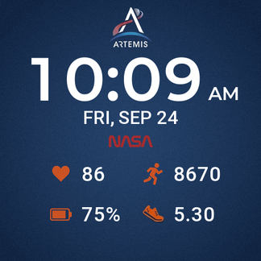

# NASA Artemis Watchface

A Zepp OS watchface for the Amazfit Cheetah Pro (480x480, round), themed after NASA's Artemis program.



## Features

- Time in 12h (with AM/PM) or 24h, following the watch setting, with a zero-padded hour
- Date as `FRI, SEP 24`, or `T6, 24/09` when the watch language is Vietnamese
- Heart rate, steps, battery percentage and distance, supplied and refreshed by the system (`--` when there is no heart rate yet)
- Battery icon switches to a charging icon while the battery percentage is rising
- Always-On Display (AOD) mode: time, date and steps on black

## Project structure

```
app.json                  Zepp OS app manifest (target: 480x480-amazfit-cheetah-pro)
app.js                    App entry
watchface/
  index.js                Watchface layout and widget bindings
  date-format.js          Date string formatting (EN / VI)
  charging.js             Charging-state heuristic
assets/480x480-amazfit-cheetah-pro/
  images/                 Generated background, icons, time and stat digits
design/                   Source mockups and icons
tools/
  generate_assets.py      Builds every PNG in assets/ from design/
  fonts/                  Source fonts and their licenses
  *.test.js               Unit tests
```

## Development

Requirements: Node.js, [Zeus CLI](https://docs.zepp.com/docs/guides/tools/cli/) (`npm i -g @zeppos/zeus-cli`), and Python 3 with Pillow and NumPy for asset generation.

```sh
npm test                  # run unit tests
npm run assets            # regenerate assets/ from design/
zeus preview              # preview in the simulator or on a device
zeus build                # build the .zab package into dist/
```

## Design notes

- **Layout** is measured from `design/watch-face-circle.png`. The layout constants in `tools/generate_assets.py` and `watchface/index.js` must stay in sync.
- **Icon extraction:** the PNGs in `design/` have a checkerboard painted in rather than real transparency. `generate_assets.py` keys single-color icons out by saturation. It keys the Artemis logo and the shoe out of the mockup against the navy dial.
- **Charging state:** Zepp OS does not expose a charging status to watchfaces. The charging icon is shown when the battery percentage rises and hidden when it falls. It appears only after the first 1% increase, and stays after unplugging at 100% until the percentage drops.
- **Digit images, not fonts:** on the Cheetah Pro, large custom-font `TEXT` widgets rendered only partially or not at all. So time (`IMG_TIME`) and stat numbers (`TEXT_IMG`) use pre-rendered digit images, generated from Montserrat and Roboto by `generate_assets.py`. Only the date is a `TEXT` widget: it needs letters, and `IMG_WEEK` has no Vietnamese weekday set. It uses the system font, because with a custom font file the device dropped glyphs (`T2, 05/10` showed as `2, 0/0`).
- **System-bound data:** following the [Zepp OS watchface samples](https://github.com/zepp-health/zeppos-samples/tree/main/watchface), time and stats are bound to system data (`IMG_TIME`, `TEXT_IMG` with `data_type`). The system updates them, including in AOD, with no sensor code or permissions. Steps therefore show without a thousands separator (`8670`), as in the spec. JS only drives the date and the charging icon, and refreshes both from a `WIDGET_DELEGATE` `resume_call`.
- **Zepp OS specification:** the watchface follows the [watchface specification](https://docs.zepp.com/docs/watchface/specification) and the [AOD design principles](https://docs.zepp.com/docs/designs/customization/screen-off-mode/#design-principles):
  - AOD uses a pure black background. It shows only the top-priority fields (time, date, steps), at the same positions as normal mode.
  - `generate_assets.py` fails if worst-case AOD content lights more than 10% of the screen.
  - The preview uses the spec's default data.
  - Images live under `images/`, as in the samples (`bg`, `icons/power`, `icons/step`, `time/0-9`, `stat/0-9`).
- **API level:** the app targets API 3.5 (minimum 2.1, needed by `Time.getHourFormat` and `onPerDay`). Widgets are updated with `setProperty`, because property setters require API 4.0.

## Credits and licenses

- [Montserrat](https://github.com/JulietaUla/Montserrat): SIL Open Font License 1.1 (`tools/fonts/Montserrat-OFL.txt`)
- [Roboto](https://github.com/googlefonts/roboto): Apache License 2.0 (`tools/fonts/Roboto-LICENSE.txt`)

This is an unofficial fan project. It is not affiliated with or endorsed by NASA. The NASA and Artemis names and logos belong to NASA and are subject to [NASA's media usage guidelines](https://www.nasa.gov/nasa-brand-center/images-and-media/).
